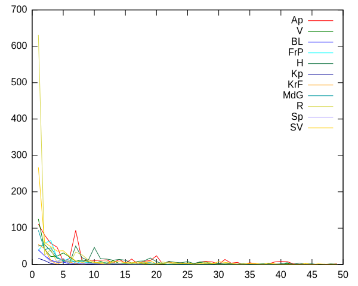
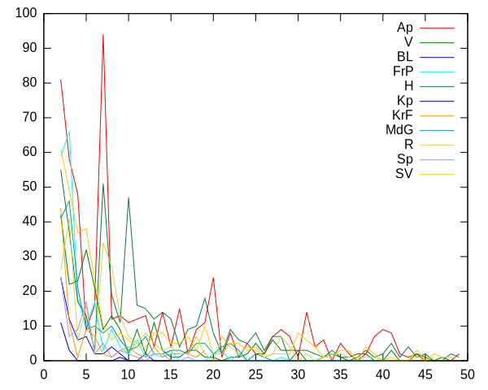
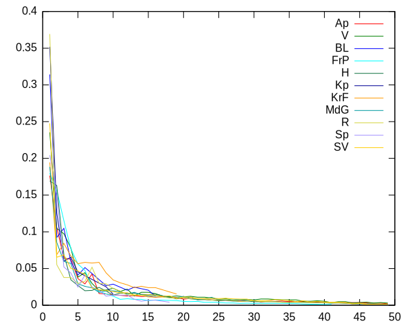

# Valg-stuff

Datafiler:

* [Ap](data/ap.csv)
* [V](data/v.csv)
* [BL](data/bl.csv)
* [FrP](data/frp.csv)
* [H](data/h.csv)
* [Kp](data/kp.csv)
* [KrF](data/krf.csv)
* [MdG](data/mdg.csv)
* [R](data/r.csv)
* [Sp](data/sp.csv)
* [SV](data/sv.csv)

# Så hva kan man gjøre med dette?

Ja, jeg vet at fargene er feil, give me a break.

## Er det noen som har fått mange slengere?

## Hva om vi dropper førstekandidatene?

Ragni Ramberg er tydeligvis populær utenfor Ap.

## Personstemmer per listestemme

Jens Ingvald Olsen og Sandra Borch er populære hos sine egne.
